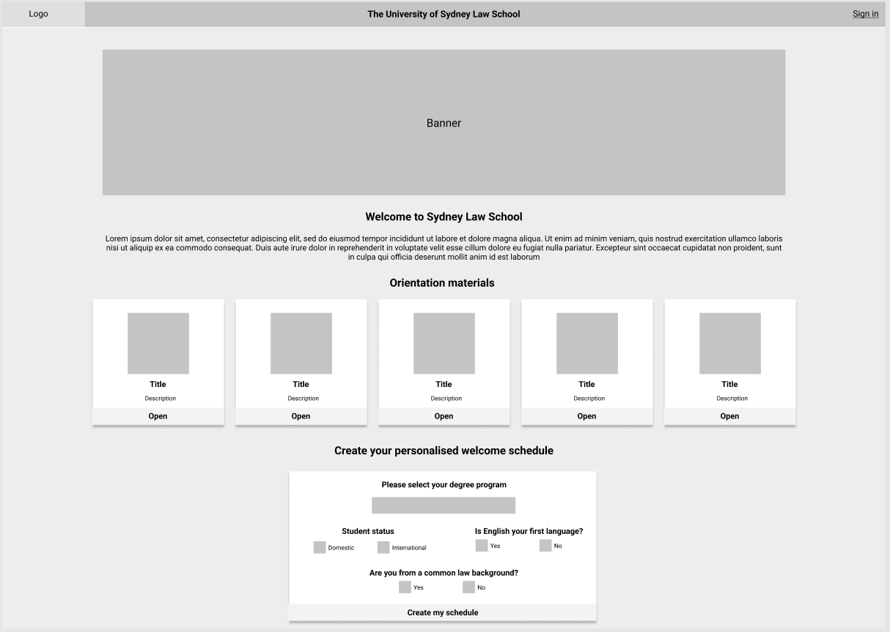

# Full Stack App (Part A)

**Author:** Geoff Reid&nbsp;&nbsp;&nbsp;&nbsp; **Date:** 6 August 2022&nbsp;&nbsp;&nbsp;&nbsp;

**Client:** <a href="https://github.com/LetTheWookieWin92/welcome-client">Repository</a>&nbsp;/&nbsp;<a href="https://sls-welcome-client.netlify.app/">Deployment</a>&nbsp;&nbsp;&nbsp;&nbsp; **API:** <a href="https://github.com/LetTheWookieWin92/welcome_api">Repository</a>&nbsp;/&nbsp;<a href="https://sls-welcome-api.herokuapp.com/events">Deployment</a>

## Website description and purpose

Sydney Law School is one of the eight faculties and schools at The University of Sydney, a higher education provider whose main campus is located in Camperdown, Sydney.

Every semester the school provides a range of orientation activities for new students who are commencing on different degree programs. Many welcome events are shared across cohorts, such as lunches, clubs and societies, but some events are specific to a student's degree program. More than one hundred orientation events take place during the university's welcome week, some of which are optional and others are compulsory.

It is often challenging for students to identify which of the many events are relevant to them and organise a schedule that makes the best use of their welcome week. The core issue is that events are organised by a number of different entities across the university, and so events quite often clash and information is spread across many web pages.

The proposed web application aims to provide a one-stop, intuitive interface for students to build a personalised schedule for events based on their degree program and their additional interests.

 

## Functionality and features

Using the application, students can:

- Enter details about themselves and their degree program to acquire a list of their compulsory events
- Browse additional events based on their interests
- Add and remove events to their personalised schedule
- View event details including start / finish time, location, presenter, etc
- Through interface prompts, identify where there are event clashes and make adjustments
- Download a PDF version of their completed schedule, containing all necessary information

The target audiences for this application are commencing students and event staff at Sydney Law School.

The application has been developed using the following tech stack:

- HTML
- CSS
- React.js (front-end)
- Ruby on Rails (API)
- Heroku (API deployment)
- Netlify (client deployment)
- GitHub (source control)
- Postgresql (database)

 

## Application Architecture Diagram

 

## Dataflow Diagram

 

## User stories

The user stories developed here include the main target audiences of the application; school administrator and students at Sydney Law School. A school administrator refers to the user who mainly aims to manage event listings that students see and students refer to users who mainly aim to search for and add events to their personalised schedule.

As a <b>student</b> user:

- I want to access all relevant orientation materials and resources
- I want to be able to enter details about myself and my degree program, so the application can show me which events I am required to attend.
- I want to be able to browse optional events based on my interests.
- I want to be able to add any compulsory or optional events to a personalised schedule, so that I can clearly see the events I will be attending.
- I want to be able to view all of the specific event details, including start time, duration, location, description, presenter and whether the event is online or in-person, so that I know what events are about and how I can attend.
- I want to be informed if any of the events I have added to my personalised schedule clash, so that I can make adjustments.
- I want to be able to download a PDF version of my personalised schedule, containing all of the important information about my events, so that I can print it out.

As a <b>staff</b> user:

- I want to be able to log in to the school's admin account to add, edit and remove events for students to see.

 

## Wireframes

 

## Screenshots

Home

Schedule

Schedule with clashes

Schedule PDF

 

## Third party services / libraries

The following third-party services have been implemented in the Welcome Planner client application:

- <a href="https://mui.com/">MaterialUI</a> – A front-end component library for building user interfaces. A range of components were implemented with MaterialUI components as a foundation, and the brand colours were implemented using MaterialUI's theme provider.
- <a href="https://react-pdf.org/">React-pdf</a> – React renderer for creating PDF files on the browser and server. This library provides the components and functionality to create complex PDFs from scratch within your JavaScript code.
- <a href="https://momentjs.com/">MomentJS</a> – React library allowing you to parse, validate, manipulate, and display dates and times in JavaScript. This is a small library but eliminates the need to implement bespoke formatting functions myself when working with ISO 8601 date formats.
- <a href="https://www.npmjs.com/package/moment-range">Moment-range</a> – Extends the functionality of MomentJS to allow me to e.g. define date ranges, easily check if there's overlap between events or add minutes/hours to dates to return the new date.

 

## Limitations

Owing to time constraints, an admin interface enabling new events to be created, updated and deleted has not been implemented as part of the first release of this application.

## Project task management

The entire project has been planned and tracked using Trello (<a href="https://trello.com/invite/b/JjdE9eMs/a183d422777e55e41db9c5762e5a9c1d/welcome-planner">see board</a>).

Start of project

24 July 2022

28 July 2022

29 July 2022

2 August 2022

4 August 2022

6 August 2022

